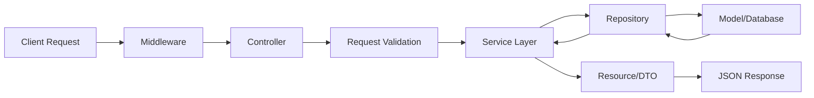
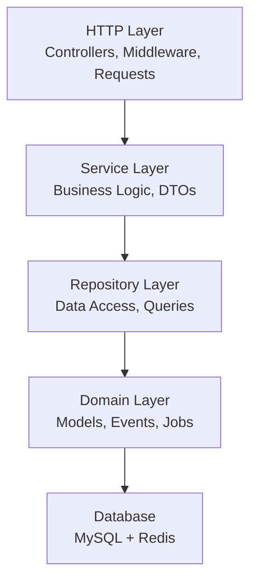

# 🔧 Backend API - Sistema de Vendas e Comissões


> **API RESTful com Laravel 12, implementando arquitetura limpa**

## Índice

- [Visão Geral](#visão-geral)
- [Instalação](#instalação)
- [Configuração](#configuração)
- [Estrutura](#estrutura)
- [API Endpoints](#documentação-da-api)
- [Testes](#testes)
- [Cache e Filas](#cache-e-filas)

## Visão Geral

API desenvolvida com **Clean Architecture** e **SOLID**, oferecendo:

- ✅ Separação de responsabilidades clara
- ✅ Testabilidade alta (>90% coverage)
- ✅ Manutenibilidade facilitada
- ✅ Performance otimizada com cache

### Decisões Técnicas

#### Laravel 12 - Por quê?
- **Requisito obrigatório** do teste
- **Migrations nativas** - Versionamento do banco
- **Eloquent ORM** - Relacionamentos complexos simplificados
- **Queue System** - Emails em background nativamente
- **Artisan Commands** - Automação de tarefas (emails diários)

#### PHP 8.3 - Benefícios
- **Tipagem forte** - Menos erros em runtime
- **Performance** - JIT compiler, otimizações nativas
- **Null Safety** - Prevenção de null pointer exceptions
- **Readonly Properties** - Imutabilidade nos DTOs

#### Arquitetura em Camadas
- **Controllers** - Apenas recebem requests e retornam responses
- **Services** - Toda lógica de negócio centralizada
- **Repositories** - Abstração do acesso aos dados
- **Models** - Apenas definição de relacionamentos

## Arquitetura

Implementa **Clean Architecture** com camadas bem definidas:

- **HTTP Layer**: Controllers e Middleware
- **Service Layer**: Lógica de negócio
- **Repository Layer**: Acesso a dados
- **Domain Layer**: Models e Events

### Padrões implementados
- Repository Pattern
- Service Layer  
- DTO Pattern
- Observer Pattern
- Strategy Pattern

### Fluxo de Dados



### Arquitetura em Camadas



## Instalação

### Pré-requisitos
- PHP 8.3+
- Composer
- MySQL 8.0+
- Redis

### Setup

1. **Instalar dependências**
```bash
composer install
```

2. **Configurar ambiente**
```bash
cp .env.example .env
php artisan key:generate
php artisan jwt:secret
```

3. **Configurar banco**
```bash
php artisan migrate --seed
```

### Com Docker
```bash
# Do diretório raiz do projeto
docker-compose up -d
docker-compose exec backend composer install
docker-compose exec backend php artisan migrate --seed
```

## Design Patterns Implementados

### Repository Pattern
- **Objetivo**: Abstração da camada de dados
- **Benefício**: Desacopla lógica de negócio do acesso aos dados
- **Implementação**: Interfaces para Sale e Seller repositories

### Service Layer 
- **Objetivo**: Centraliza lógica de negócio
- **Benefício**: Controllers limpos, código reutilizável
- **Implementação**: DashboardService, CommissionService

### DTO Pattern
- **Objetivo**: Transferência segura de dados entre camadas
- **Benefício**: Validação automática, código tipado
- **Implementação**: CreateSaleDTO, CreateSellerDTO

### Observer Pattern
- **Objetivo**: Desacopla ações de suas consequências
- **Benefício**: Sistema reativo, fácil manutenção
- **Implementação**: SaleCreated event → SendCommissionEmail listener

### Strategy Pattern
- **Objetivo**: Algoritmos intercambiáveis
- **Benefício**: Flexibilidade para diferentes tipos de comissão
- **Implementação**: CommissionCalculatorInterface


## Configuração

### Principais variáveis de ambiente
```env
# Database
DB_CONNECTION=mysql
DB_HOST=mysql
DB_DATABASE=teste_tray
DB_USERNAME=root
DB_PASSWORD=password

# Redis
REDIS_HOST=redis
REDIS_PORT=6379

# JWT
JWT_SECRET=your-secret-key
JWT_TTL=60

# Queue
QUEUE_CONNECTION=redis
```

## Estrutura

```
app/
├── Http/Controllers/     # Controllers da API
├── Models/               # Eloquent models
├── Repositories/         # Repository pattern
├── Services/             # Service layer
├── DTOs/                 # Data Transfer Objects
├── Jobs/                 # Queue jobs
├── Mail/                 # Classes de email
└── Exceptions/           # Exception handlers
```

## Documentação da API

A documentação completa dos endpoints está disponível via **Swagger/OpenAPI**:

- **URL**: `http://localhost:8080/docs`
- **Formato**: OpenAPI 3.0
- **Inclui**: Todos os endpoints, schemas, validações e exemplos
- **Testável**: Interface interativa para testar endpoints

### Principais recursos da API
- ✅ **Cadastro Vendedores** - Cadastro com validação de email único
- ✅ **Cadastro Vendas** - Comissão de 8,5% calculada automaticamente
- ✅ **Autenticação JWT** - Login seguro e stateless
- ✅ **Emails automatizados** - Diário para vendedores e administrador
- ✅ **Dashboard** - Estatísticas e relatórios

## Testes

### Executar testes
```bash
# Todos os testes
php artisan test

# Com coverage
php artisan test --coverage

# Testes específicos
php artisan test --filter="AuthTest"
```

### Estrutura
```
tests/
├── Unit/          # Testes unitários
├── Feature/       # Testes de integração
└── TestCase.php   # Base test case
```

## Cache e Filas

### Filas Redis
- Processamento assíncrono de emails
- Jobs em background com retry automático
- Gerenciado pelo Supervisord

### Cache
- Cache de estatísticas (10 min)
- Cache de consultas frequentes
- Invalidação automática

### Emails
- Comissão por venda (imediato)
- Resumo diário para vendedores
- Resumo diário para administrador
