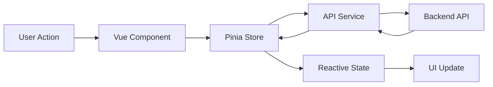
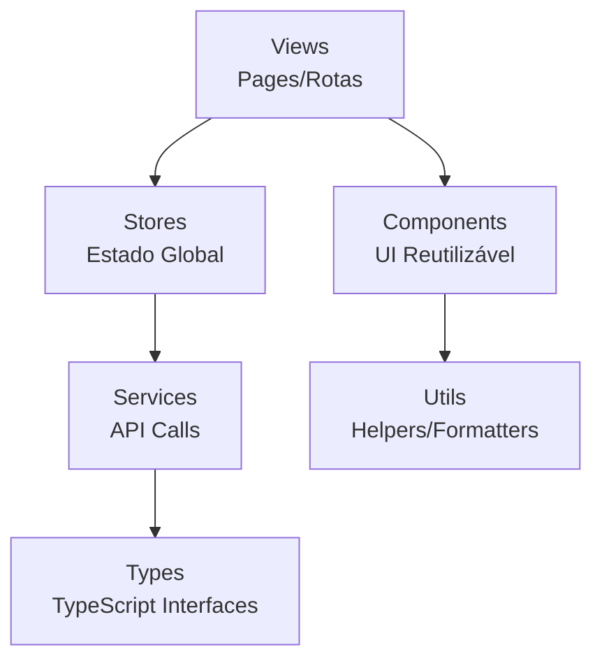

# 🎨 Frontend SPA - Sistema de Vendas e Comissões


> **Aplicação Single Page moderna com Vue.js 3 e TypeScript**

## Índice

- [Visão Geral](#visão-geral)
- [Tecnologias](#tecnologias)
- [Arquitetura](#arquitetura)
- [Instalação](#instalação)
- [Estrutura](#estrutura)
- [Build](#build)

## Visão Geral

SPA desenvolvida seguindo requisitos do teste com arquitetura moderna:

### Funcionalidades Implementadas
- ✅ **Dashboard** - Estatísticas em tempo real com gráficos
- ✅ **CRUD Vendedores** - Cadastro com validação de email único
- ✅ **CRUD Vendas** - Comissão de 8,5% calculada automaticamente  
- ✅ **Autenticação JWT** - Login seguro e persistente
- ✅ **Interface responsiva** - Otimizada para desktop e mobile
- ✅ **Notificações** - Feedback visual para ações do usuário

## Tecnologias

### Requisitos Obrigatórios
- **HTML/CSS/JavaScript** - Base para desenvolvimento web
- **Vue.js 3** - Framework JavaScript reativo (requisito do teste)

### Principais Tecnologias

#### Vue.js 3 - Framework Principal
- **Requisito obrigatório** do teste
- **Composition API** - Melhor organização e TypeScript
- **Reatividade declarativa** - Interface responde automaticamente
- **Performance** - Virtual DOM otimizado

#### TypeScript - Tipagem Estática (Bônus)
- **Type Safety** - Previne erros em desenvolvimento
- **Intellisense** - Autocomplete e refatoração segura
- **Escalabilidade** - Manutenção facilitada

#### Pinia vs Vuex
- **Composition API nativo** - Sintaxe mais limpa
- **TypeScript first** - Tipagem automática
- **Modular** - Stores independentes
- **Menor bundle** - Mais leve que Vuex

#### Naive UI vs outras libs
- **TypeScript nativo** - Componentes tipados
- **Vue 3 otimizado** - Feito para Composition API
- **Tree-shaking eficiente** - Bundle otimizado

## Instalação

### Pré-requisitos
- Node.js 22+
- npm ou yarn

### Setup

1. **Instalar dependências**
```bash
npm install
```

2. **Configurar ambiente**
```bash
# Configurar URL da API no .env ou vite.config.ts
VITE_API_URL=http://localhost:8080
```

3. **Executar em desenvolvimento**
```bash
npm run dev
```

### Com Docker
```bash
# Do diretório raiz do projeto
docker-compose up -d
docker-compose exec frontend npm install
```

## Arquitetura

### Design Patterns Implementados
- **Factory Pattern** - ServiceFactory para APIs
- **Repository Pattern** - Abstração de acesso a dados
- **Observer Pattern** - Reatividade Vue + Pinia stores  
- **Composite Pattern** - Componentes reutilizáveis
- **Strategy Pattern** - Formatters intercambiáveis

### Decisões Arquiteturais
- **Composition API** - Melhor TypeScript e reutilização
- **Single File Components** - Encapsulamento com CSS scoped
- **Pinia State Management** - Estado global reativo
- **TypeScript DTOs** - Tipagem de API requests/responses

### Fluxo da Aplicação



### Arquitetura Frontend



## Estrutura

```
src/
├── components/       # Componentes reutilizáveis
├── views/           # Páginas da aplicação
├── stores/          # Estado global (Pinia)
├── services/        # Serviços de API
├── types/           # Tipos TypeScript
├── router/          # Configuração de rotas
├── utils/           # Utilitários
└── assets/          # Recursos estáticos
```

## Componentes

### Principais componentes
- **DashboardCard** - Cards de estatísticas
- **DataTable** - Tabela com paginação
- **FormModal** - Modais de formulário
- **LoadingSpinner** - Indicador de carregamento
- **NotificationToast** - Notificações

### Padrões utilizados
- Composition API
- Props tipadas com TypeScript
- Emits definidos
- Slots para customização

## Estado Global

### Stores principais
- **useAuthStore** - Autenticação e usuário
- **useSalesStore** - Gestão de vendas
- **useSellersStore** - Gestão de vendedores
- **useDashboardStore** - Estatísticas

### Persistência
- Token JWT no localStorage
- Estado reativo com Pinia

**Solução**: Camada de abstração

## � Instalação

### Pré-requisitos
- Node.js 22+
- npm ou yarn

### Setup
```bash
npm install
npm run dev
```

### Com Docker
```bash
# Do diretório raiz do projeto
docker-compose up -d
docker-compose exec frontend npm install
```

## Build

### Desenvolvimento
```bash
npm run dev    # Servidor de desenvolvimento
npm run build  # Build para produção
npm run preview # Preview do build
```
